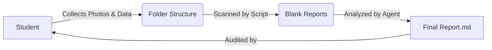

# Disaster Reconnaissance Report Generator

**Automated technical reporting for post-disaster structural assessments.**

This system combines student-collected field data with AI Agent analysis to generate consistent, high-quality reconnaissance reports.

## 🚀 Quick Links
*   **For Students**: 📸 **[Data Collection Guide](DATA_COLLECTION_GUIDE.md)** - *Start here!*
*   **For Reviewers**: 🤖 **[Analysis Guidelines](analysis_guidelines.md)** - *How to audit the AI.*
*   **Result Example**: 📄 **[Sample Report](mayfield/individual/address1/Report.md)**

---

## 🔄 Workflow Overview



1.  **Student**: Collects data and organizes it into a standard folder structure.
2.  **Script**: `generate_reports.py` creates the schema-compliant Markdown tables.
3.  **Agent**: AI analyzes images to fill in technical details (Damage, Archetype).
4.  **Student**: Verifies the AI's work and adds precise GPS/Research data.

---

## 👩‍🎓 For Students

**Your primary job is Data Collection & Verification.**

1.  **Read the Rules**: Go to the **[Data Collection Guide](DATA_COLLECTION_GUIDE.md)**.
    *   *Critical*: Naming conventions (e.g., `front_facade.jpg`) and GPS coordinates are mandatory.
2.  **Organize Your Folders**: Ensure your disaster folder matches the required structure (see Guide).
3.  **Audit the Result**: Once the report is generated, you will use the **[Analysis Guidelines](analysis_guidelines.md)** to check the `Report.md` for accuracy.

---

## 👨‍🏫 For Instructors (Running the System)

### Prerequisites
*   Python 3.12+
*   `pip install pandas openpyxl`

### Step 1: Prepare the Data
Ensure students have submitted their folders according to the [Data Collection Guide](DATA_COLLECTION_GUIDE.md).
*Structure Preview:*
```text
[Disaster_Name]/
├── individual/
│   └── [Property_Address]/
│       ├── photos/
│       │   ├── timeline/ (YYYY_filename.jpg)
│       │   ├── before/
│       │   └── after/
│       └── files/
```

### Step 2: Run Scaffolding
Run the script to generate blank reports for every property.
```bash
python3 generate_reports.py --disaster [Disaster_Folder_Name]
```

### Step 3: Run Agent Analysis
Ask the AI Agent (Antigravity):
> "Run the Batch Processing workflow on `[Disaster_Folder_Name]`."

---

## 🧠 System Logic & Schema

*   **Schema**: **[features.xlsx](features.xlsx)** defines every row in the report (Attribute Name, Options, Prompt Logic).
    *   *Note*: Includes unified logic for both Tornado and Flood hazards.
*   **Archetypes**: **[archetypes.xlsx](archetypes.xlsx)** defines the valid building types (T1-T12).

### Folder Structure
*   `generate_reports.py`: The automation script.
*   `DATA_COLLECTION_GUIDE.md`: Instructions for students.
*   `analysis_guidelines.md`: Rules for the AI and verifying students.
*   `.agent/workflows/`: Automated agent instructions.
