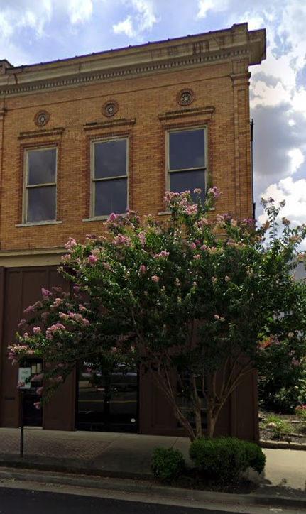
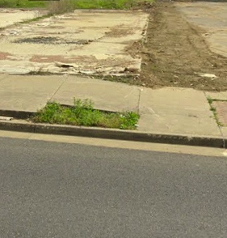
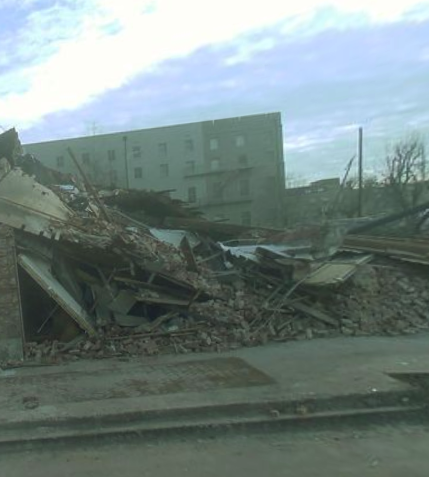

# Property Analysis: address1

## Images
### Before

### After

### Timeline Evidence

## Documents
_No PDF documents found._

## Feature Analysis
> **Note:** If observed value is not in 'Input Choices', please note 'Add [Value] to choices'.

| Attribute Name | Observation (Before) | Observation (After) | Uncertainty | Input Choices | Identification Guide |
| :--- | :--- | :--- | :--- | :--- | :--- |
| Property ID | 198 | | Low | Address | Use the folder name assigned in OneDrive; this is the primary key. |
| Property Name | N/A | | Low | Current or Historic Name | Search NRHP database by property address or name. |
| National Register ID | N/A | | Low | 8 or 9-digit Reference Number | Search NRHP database by address or name. |
| Archetype Number | T8 | | Low | T1-19 for tornado or T 1-15 for flood | See archetypes spreadsheet |
| Archetype Description | 2-story unreinforced masonry commercial building with storefront glazing. | | Low | make this be a full description  | Describe building use based on "Before" signage and architectural style. |
| Pre-Event Status | Active | | Low | Active, Mothballed, Abandoned, Under Renovation | Look for "Before" clues like boarded windows (mothballed) vs. signage (active). |
| Significance Type | Local | | Low | Local, State, National, World Heritage | Extracted from the NRHP nomination narrative text. |
| Construction Year | 1900 (est) | | Moderate | Numeric Year (e.g., 1910) | Use year listed in NRHP/Property Cards; estimate by style if missing. |
| Structural Wall System | URM (Brick) | | Low | URM (Brick), URM (Stone), URM (Concrete), Hybrid, Wood Frame | Look for header rows (sideways bricks) indicating multi-wythe structural URM. |
| Wall Anchorage Type | None | | Low | None, Star/S-Plates, Punched Plates, Through-Bolts, Iron Straps | Identify metal hardware at floor or roof lines on "Before" facades. |
| Masonry Leaves | 3 | | Moderate | 1, 2, 3, 4+ Wythes | Check window depth or corner exposures in technical documentation. |
| Wall Thickness | 13 inches | | Moderate | Numeric (inches or mm) | Extract from NRHP technical description or floor plans. |
| Number of Stories | 2 | | Low | 1, 1.5, 2, 3, 4, 5, 6+ | Count horizontal window rows from street-level imagery. |
| Urban Setting | Urban | | Low | Urban, Suburban, Rural | Assess density and proximity to neighbors in "Before" satellite view. |
| Building Position | Mid-block | | Low | Corner, Mid-block, End-of-block | Determine position relative to intersections from map data. |
| Material (Vertical) | Red Brick | | Low | Primary Wall Material (Brick, Stone, etc.) | Identify the primary facade load-bearing material. |
| Material (Horizontal) | Timber | | Moderate | Primary Floor Material (Timber, Concrete, etc.) | Extract from recon reports; often timber in older historic buildings. |
| EF-Rating (Local) | EF3 | | Moderate | EF0, EF1, EF2, EF3, EF4 | Use NWS/NOAA DAT coordinates to find local intensity at the site. |
| Mechanism of Failure | | Out-of-Plane | Low | Global, Out-of-Plane, Roof-First, Secondary Element | Roof-First = Walls stand, roof missing; Out-of-Plane = Masonry wall collapsed. |
| Roof System | Timber Truss | | Moderate | Timber Truss, Heavy Masonry, Steel, Hybrid | Determine based on recon notes or debris visibility in "After" photos. |
| Roof Shape & Slope | Flat / Low | | Low | Flat, Gable, Hip, Mansard; High, Med, Low slope | Analyze geometry from top-down or oblique aerial views. |
| Roof-Wall Attachment | Unknown | | High | Toe-Nail, Bolts, Straps, Hurricane Clips, Unknown | Crucial for "Roof-First" failures; check recon/FAST reports. |
| Parapet/Overhang | 24 inches | | Moderate | Numeric (inches/cm) | Visually estimate from "Before" oblique imagery or facade photos. |
| First-Floor Elevation | 0 | | Low | Numeric (relative to ground) | Compare threshold of lowest door to adjacent ground grade. |
| Visible Water Line | N/A | | Low | Numeric (meters or feet) | Identify debris lines or horizontal silt stains on the masonry. |
| Masonry Saturation | None | | Low | None, Capillary Rise, Saturated, Efflorescence | Capillary Rise = Dark band at base; Efflorescence = White salt stains. |
| Mortar Condition | Intact | | Low | Crumbly/Sandy, Hard, Missing, Intact | Zoom into high-res "After" photos to check for joint erosion/voids. |
| Wall Damage (N,S,E,W) | | Severe (North) | Low | Undamaged, Minor, Moderate, Severe, Destroyed | Assess each facade separately; look for cracks, bowing, or collapse. |
| Wall Structure Damage | | Collapse of upper story wythes | Low | Damage to structural wythes (N,S,E,W) | Identifies if the load-bearing mass failed vs. just surface finish. |
| Substrate/Cladding | | N/A (Standard Brick) | Low | Damage to veneer/outer wythe (N,S,E,W) | Identifies surface-only damage (e.g., loss of brick face or siding). |
| Fenestration Status | | 50% Broken (Front) | Low | % Broken/Damaged per facade (N,S,E,W) | Percent of window/door area that is failed or missing. |
| Protection Present | None | | Low | Shutters, Impact Glass, Plywood, None | Check for protective hardware or boards in "After" images. |
| Door Presence | Standard door | | Low | Large door, Standard door, Not present (N,S,E,W) | Large doors (e.g., fire halls) are high-pressure failure points. |
| Building Use Plan | | Demolished | Low | Demolished, Rededicated, Restored, Abandoned | Compare imagery from 1-3 years post-event to determine outcome. |
| Existence (Year -5) | Yes | | Low | Yes / No | Track presence of the structure using multi-year historic aerials. |
| Existence (Year -4) | Yes | | Low | Yes / No | Track presence of the structure using multi-year historic aerials. |
| Existence (Year -3) | Yes | | Low | Yes / No | Track presence of the structure using multi-year historic aerials. |
| Existence (Year -2) | Yes | | Low | Yes / No | Track presence of the structure using multi-year historic aerials. |
| Existence (Year -1) | Yes | | Low | Yes / No | Track presence of the structure using multi-year historic aerials. |
| Existence (Event Year) | Yes | | Low | Yes / No | Track presence of the structure using multi-year historic aerials. |
| Existence (Year +1) | | No | Low | Yes / No | Track presence of the structure using multi-year historic aerials. |
| Existence (Year +2) | | No | Low | Yes / No | Track presence of the structure using multi-year historic aerials. |
| Existence (Year +3) | | No | Low | Yes / No | Track presence of the structure using multi-year historic aerials. |
| Existence (Year +4) | | No | Low | Yes / No | Track presence of the structure using multi-year historic aerials. |
| Existence (Year +5) | | No | Low | Yes / No | Track presence of the structure using multi-year historic aerials. |
